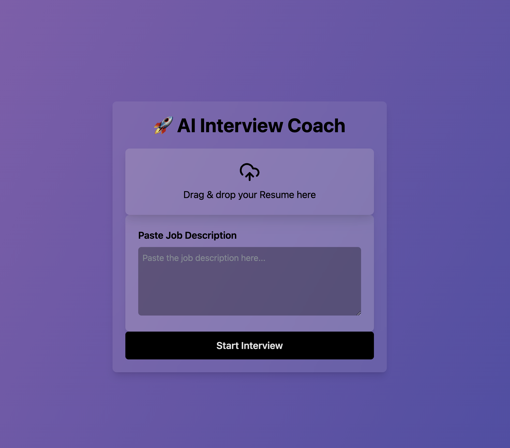

# 🎤 AI Interview Coach

AI Interview Coach is an **AI-powered mock interview platform** designed to help job seekers **practice their interview skills** through **real-time voice interactions**. It simulates a realistic **AI-driven interviewer** that asks questions based on the **user's resume and job description**, providing a fully immersive mock interview experience.

---

🔥 **AI-powered interview coaching—because practice makes perfect!** 🎤💼



## 🚀 Features

✅ **Resume & Job Description Processing**
- Upload a **PDF resume** and paste a **job description**.
- AI analyzes both to **generate personalized questions**.

✅ **AI-Powered Voice Interview**
- AI asks **structured interview questions** based on:
    - **Behavioral patterns**
    - **Resume insights**
    - **Job description relevance**
- Users respond **by speaking**, and AI **processes answers in real-time**.

✅ **Speech-to-Text & AI Voice Feedback**
- Converts **spoken words into text**.
- AI **analyzes responses** and provides **follow-up questions**.
- AI **speaks back responses**, simulating a real interviewer.

✅ **Futuristic UI/UX**
- **Dark mode** with **glassmorphism & neon accents**.
- **Dynamic gradient animation** for a modern, sleek feel.
- **Large animated microphone button** that reacts to speech.

✅ **Real-Time AI Responses**
- AI **adjusts questions** based on user responses.
- Users receive **instant feedback** on **clarity, structure, and relevance**.

---

## 🛠️ Installation & Setup

### 1️⃣ Prerequisites
- **Node.js** installed
- **An OpenAI API Key** (Sign up at [OpenAI](https://openai.com/))

### 2️⃣ Setup Steps

#### Clone the Repository
```bash
git clone https://github.com/fanxiaotuGod/interview-coach
cd interview-coach
```

#### Install Dependencies
```bash
npm install
```

#### Configure OpenAI API Key
1. Create a `.env.local` file in the root directory.
2. Add your OpenAI API Key:
```bash
VITE_OPENAI_API_KEY=your-api-key-here
```

#### Start the Development Server
```bash
npm run dev
```

---

## 🎮 How to Use

### 1️⃣ Upload Resume & Enter Job Description
- **Drag & drop your resume (PDF)** into the upload box.
- **Paste the job description** into the text area.
- Click **Start Interview**.

### 2️⃣ AI-Powered Mock Interview
- AI **asks questions aloud** based on your resume & job.
- **Speak your answer** into the microphone.
- AI **interprets your response** and asks follow-up questions.

### 3️⃣ Real-Time Feedback
- AI provides **instant feedback & insights**.
- The conversation **flows naturally** like a real interview.

---

## 🎯 Use Cases
🎓 **Students & Job Seekers** – Practice and improve interview skills.  
🤖 **HR & Recruiters** – Customize AI-generated interview questions.  
💡 **Hackathons & AI Research** – Demonstrates **AI-human voice interaction**.

---

## 📌 Future Enhancements
🔹 **AI-driven scoring system** to evaluate responses.  
🔹 **Live transcription & response playback**.  
🔹 **Multi-language support**.  
🔹 **Integration with LinkedIn & ATS** to **auto-optimize resumes**.

---

## 🎭 Why This Project?
This project **redefines AI-driven mock interviews** by combining **voice interaction, AI-driven insights, and real-time feedback** to create a **fully immersive interview simulation**. 🚀

🔹 **Contributions Welcome!**  

